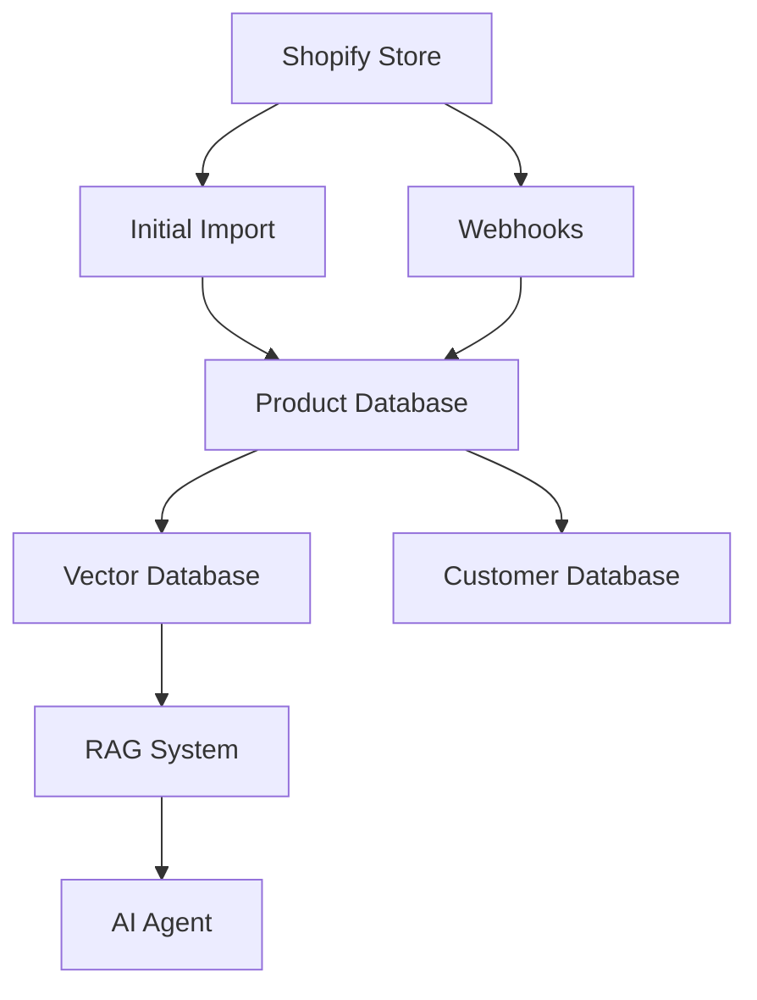

I'll help outline a clear structure for integrating Shopify with your application. Based on the code provided, I see you already have some Shopify integration started and a Python infrastructure for handling products.

Here's a proposed architecture and implementation plan:

### 1. Data Architecture



### 2. Implementation Steps

#### A. Shopify Integration Layer
```typescript
interface ShopifyConfig {
  apiKey: string;
  apiSecret: string;
  adminApiKey: string;
  shop: string;
  webhookEndpoints: {
    products: string;
    customers: string;
    orders: string;
  }
}

interface ProductMetadata {
  handle: string;
  title: string;
  description: string;
  embedding: number[];
  lastUpdated: Date;
  $createdAt: Date
  $updatedAt: Date
  $id: string //will be shopify ID
}
```

#### B. Data Flow Structure

1. **Initial Import System**:
```python
class ShopifyImporter:
    def __init__(self, shop_config: ShopifyConfig):
        self.client = shopify.GraphQLClient(...)
        self.chroma_client = chromadb.Client()
        self.collection = self.chroma_client.create_collection(
            name="products",
            metadata={"store": shop_config.shop}
        )
    
    async def import_products(self):
        """Bulk import products directly to Chroma"""
        products = await self.fetch_all_products()
        
        # Chroma handles embedding generation automatically
        await self.collection.add(
            ids=[p.id for p in products],
            documents=[self.prepare_product_text(p) for p in products],
            metadatas=[{
                "handle": p.handle,
                "title": p.title,
                "price": p.price,
                "last_updated": p.updated_at
            } for p in products]
        )
    
    def prepare_product_text(self, product):
        """Prepare product text for embedding"""
        return f"""
        Title: {product.title}
        Description: {product.description}
        Type: {product.type}
        Tags: {', '.join(product.tags)}
        """
```

### 3. Action Plan

1. **Set Up Data Stores**
   - Use your existing Appwrite for customer data
   - Add PGVector for embeddings storage
   - Keep minimal product metadata in Appwrite

2. **Create Import Pipeline**
   - Build on your existing Python product generator:
   
```python
def get_product_json(category: Dict) -> List[Dict]:
    """Make API call to GPT-4 to generate product data"""
    
    system_prompt = """You are a product catalog generator. Generate realistic product data in JSON format following this template for each product:
    {
        "Handle": "unique-product-handle",
        "Title": "Product Title",
        "Body": "Product description",
        "Vendor": "Brand name",
        "Product_Category": "Main category > Subcategory",
        "Type": "Product type",
        "Tags": "tag1, tag2",
        "Published": "TRUE",
        "Option1_Name": "Size/Type",
        "Option1_Value": "Value",
        "Variant_SKU": "SKU-123",
        "Variant_Grams": "1000",
        "Variant_Price": "99.99",
        "Status": "active"
    }"""

    try:
        response = client.chat.completions.create(
            model="gpt-4o-mini",
            messages=[
                {"role": "system", "content": system_prompt},
                {"role": "user", "content": category["prompt"]}
            ],
            temperature=0.7,
            response_format={"type": "json_object"}
        )
        print(response.choices[0].message.content)
        
        products = json.loads(response.choices[0].message.content)
        return products

```

   - Add embedding generation
   - Set up batch processing

3. **Webhook System**
```python
class ShopifyWebhookHandler:
    async def handle_product_update(self, data: dict):
        # Update product in database
        # Regenerate embeddings
        # Update vector store
        
    async def handle_customer_update(self, data: dict):
        # Update customer in Appwrite
        # Trigger any necessary notifications
```

4. **RAG Implementation**
```python
class ProductRAGSystem:
    def __init__(self):
        self.vector_store = PGVector(...)
        self.llm = ChatOpenAI(...)
    
    async def answer_query(self, question: str):
        # Get relevant products with metadata
        results = await self.collection.query(
            query_texts=[question],
            n_results=3,
            include=["documents", "metadatas"]
        )
        
        # Build context from results
        context = self.build_context(results)
        
        # Generate response with LLM
        return await self.llm.generate_response(question, context)
```

### 4. Recommended Implementation Order

1. **Phase 1: Data Foundation**
   - Set up Shopify Admin API connection (building on your existing code)
   - Create product import system
   - Implement basic webhook receivers

2. **Phase 2: Embedding System**
   - Set up vector database
   - Create embedding generation pipeline
   - Implement product text preparation

3. **Phase 3: RAG System**
   - Implement similarity search
   - Create prompt engineering system
   - Build response generation

4. **Phase 4: Integration**
   - Connect to chat system
   - Implement customer context injection
   - Add monitoring and logging

### 5. Key Technical Decisions

1. **Storage Strategy**
- Keep Shopify as source of truth for product data
- Store embeddings and metadata locally
- Use Appwrite for customer data and chat history

2. **Update Strategy**
- Use webhooks for real-time updates
- Implement periodic full sync as backup
- Keep embedding updates asynchronous

3. **Performance Considerations**
- Implement batch processing for initial import
- Use caching for frequent queries
- Implement rate limiting for Shopify API

Would you like me to elaborate on any of these aspects or provide more detailed implementation code for a specific component?
